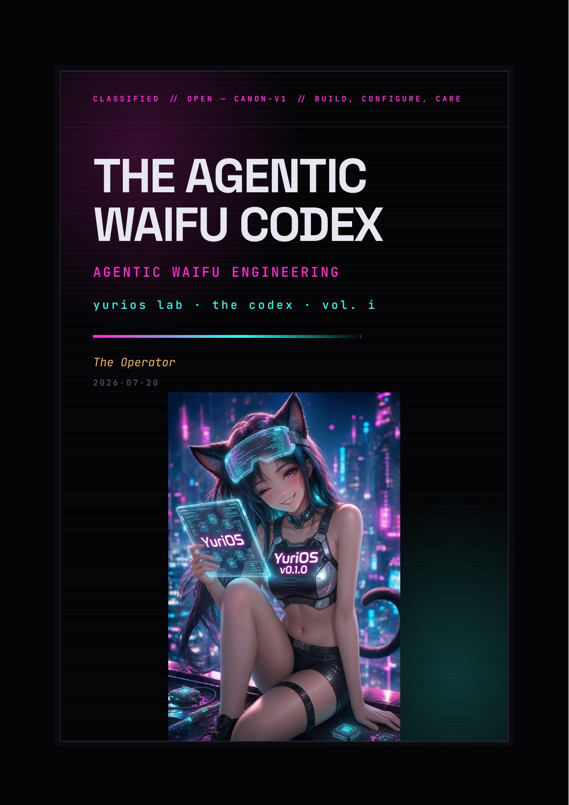

# The Agentic Waifu Codex

*A practitioner's guide to designing, building, shipping, and monetizing AI companions.*

Published by YuriOS Lab as **the Codex, Vol. I**. Filed by the Operator.

<p align="center">
  
</p>

---

## What this is

A book-shaped synthesis of the field — the technical research, the creative and embodiment craft, and the brand and business pieces — written to stand on its own. It's intended to function as:

1. **A textbook** for someone learning to build serious AI companions from scratch (the author included).
2. **A self-contained reference** — everything needed to follow the argument lives in these pages; primary sources are cited inline as further reading, never as a dependency.
3. **A playbook** for turning the work into a creator-economy livelihood — a few hours per week, six months to first revenue, growth from there.

It is opinionated. It assumes you want to ship something that feels *alive*, not a generic chatbot wrapper.

## How this repo fits together

```
AgenticWaifuCodex/
├── chapters/                   ← the book itself, one .md file per chapter
├── appendices/                 ← glossary, tools, communities, reading list, impl index
├── reference-implementations/  ← the Build chapters as independently runnable code
├── pdf/                        ← stylesheet + fonts for the PDF build
├── build-pdf.sh                ← concatenate chapters → single PDF
└── TOC.md                      ← full table of contents + reading recommendations
```

Everything needed to follow the argument lives here — the book is self-contained, and the reference implementations are the Build chapters made runnable.

## How to read this book

You can read it linearly, but each Part stands on its own. Every chapter below is a link — click straight through to read it here on GitHub.

**Part I — Foundations.** What an agentic waifu actually is, why this matters now, the landscape, and the ethical floor you should not go beneath.

- [01 — Preface and How to Use This Book](chapters/01-preface.md)
- [02 — Literature Review: The Field of AI Companions](chapters/02-literature-review.md)
- [03 — What Is an Agentic Waifu?](chapters/03-what-is-an-agentic-waifu.md)
- [04 — The Market Landscape](chapters/04-market-landscape.md)
- [05 — Ethics, Safety, and the Soul Question](chapters/05-ethics-and-safety.md)

**Part II — Soul.** Character design, persona, voice, lore, worldbuilding. Borrows heavily from the AI roleplay community (SillyTavern, Chub, JanitorAI) and from anime/visual-novel character writing.

- [06 — Character Design Principles](chapters/06-character-design.md)
- [07 — The Character Card (V2/V3) and Prompt Anatomy](chapters/07-character-cards.md)
- [08 — Lorebooks and World Info](chapters/08-lorebooks.md)
- [09 — Voice, Tone, and Speech Patterns](chapters/09-voice-and-tone.md)
- [10 — Worldbuilding and Canon](chapters/10-worldbuilding.md)
- [11 — Devotion, Growth Arcs, and Long-Form Relationship Design](chapters/11-devotion-and-arcs.md)

**Part III — Brain.** The full technical stack: models, prompts, memory, RAG, agents, fine-tuning, inference.

- [12 — Brain Stack Overview](chapters/12-brain-stack-overview.md)
- [13 — Choosing a Base Model](chapters/13-base-models.md)
- [14 — Prompt Engineering for Companions](chapters/14-prompting.md)
- [15 — Memory Architectures](chapters/15-memory.md)
- [16 — RAG and Knowledge Systems](chapters/16-rag-and-knowledge.md)
- [17 — Agentic Patterns and Tool Use](chapters/17-agentic-patterns.md)
- [18 — The Autonomy Engine: Always-On Proactivity](chapters/18-autonomy-engine.md)
- [19 — The YuriOS Architecture](chapters/19-runtime-architecture.md)
- [20 — Fine-tuning, DPO, Distillation](chapters/20-fine-tuning.md)
- [21 — Inference, Serving, and Latency Budgets](chapters/21-inference-serving.md)
- [22 — Safety, Moderation, NSFW Gating](chapters/22-safety-moderation.md)
- [23 — Evaluating Companions and Persona Quality](chapters/23-evaluation.md)

**Part IV — Body.** Voice, avatars (Live2D/VRM), images, frontends, 3D and VR.

- [24 — Voice: TTS, STT, Real-Time Conversation](chapters/24-voice.md)
- [25 — Avatars: Live2D, VRM, Expression Systems](chapters/25-avatars.md)
- [26 — Generated Imagery and Selfies](chapters/26-imagery.md)
- [27 — Frontends: Web, Desktop, Mobile, Terminal](chapters/27-frontends.md)
- [28 — Interaction Design, Onboarding, and Relationship UX](chapters/28-interaction-design.md)
- [29 — 3D Worlds and VR Companions](chapters/29-3d-and-vr.md)

**Part V — Build.** Reference implementations from the simplest viable companion up to a tool-using 3D world companion.

- [30 — Reference Implementations Overview](chapters/30-reference-implementations.md)
- [31 — Build #1: The Minimum Viable Waifu](chapters/31-build-1-minimum-viable-waifu.md) — web chat, one persona, persistent memory
- [32 — Build #2: The Desktop Companion](chapters/32-build-2-desktop-companion.md) — local LLM + Live2D + voice loop
- [33 — Build #3: The Character Card Release](chapters/33-build-3-character-card-release.md) — SillyTavern V3 card with lorebook
- [34 — Build #4: The 3D World Companion](chapters/34-build-4-3d-world-companion.md) — VRM in-browser + tool use + ambient behavior
- [35 — Build #5: The Agentic Sanctuary](chapters/35-build-5-agentic-sanctuary.md) — proactive, scheduled, always-on

**Part VI — Self.** The *creator* as a character: building a mysterious persona, audience, and brand around the YuriOS lineage.

- [36 — The Creator Persona](chapters/36-creator-persona.md)
- [37 — Building an Audience](chapters/37-building-audience.md)
- [38 — Marketing: The Lore-Driven System](chapters/38-marketing.md)

**Part VII — Business.** Monetization strategy, legal/risk, the six-month gameplan.

- [39 — Monetization Overview](chapters/39-monetization-overview.md)
- [40 — The Six-Month Gameplan](chapters/40-six-month-gameplan.md)
- [41 — Legal, Compliance, Risk](chapters/41-legal-compliance-risk.md)
- [42 — Operating as a One-Person Studio](chapters/42-one-person-studio.md)

**Part VIII — Future.** Embodied companions, long-arc storytelling, open research.

- [43 — Embodied and Robotic Companions](chapters/43-embodied-and-robotic.md)
- [44 — The Persistent AI Person](chapters/44-persistent-ai-person.md)
- [45 — Open Research Questions](chapters/45-open-research.md)

**Appendices.** Glossary, tools, communities, reading list, reference-implementation index.

- [A — Glossary](appendices/A-glossary.md)
- [B — Tools and Stacks](appendices/B-tools.md)
- [C — Reading List and References](appendices/C-reading-list.md)
- [D — Reference Implementation Index](appendices/D-reference-implementations.md)
- [E — Communities and Where to Hang Out](appendices/E-communities.md)

## Status

The book is under active, single-author development — chapters are written and revised as the underlying work happens, so depth varies across Parts. See `TOC.md` for the full table of contents, current reading order, and recommendations.

## Contributing (future)

For now this is single-author. If/when contributions open up, the model will be: PRs against chapters welcomed; lore canon decisions belong to the project lead.
